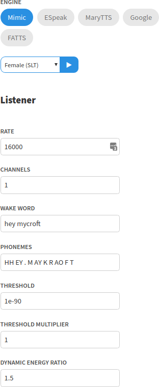
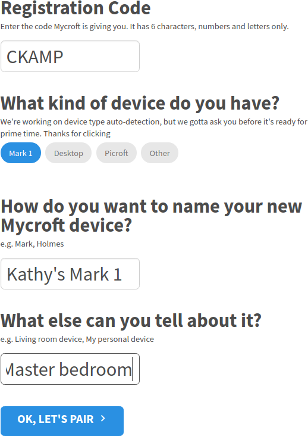

# Your home.mycroft.ai account

Each of your Mycroft **Device(s)** must be **Paired** with your [home.mycroft.ai](https://home.mycroft.ai) account. Pairing makes information available to your Device to personalise your experience, such as which units of measurement you prefer, and your general location.

## Creating a home.mycroft.ai account

You can [create a home.mycroft.ai account](https://home.mycroft.ai/#/signup) by using

* Your Facebook account or;
* Your Google account or;
* Your GitHub account or;
* By signing up with your email address and choosing a password

## home.mycroft.ai settings

Choose 'Settings' from the top menu. Basic Settings will be displayed. These allow you to choose your preferred:

* Units of measurement (_NOTE: choosing Miles instead of Kilometers will also switch your temperature format to Fahrenheit instead of Celsius_)
* Date format
* Time format

All your Mycroft devices will use this information to tailor your experience.

If you do make changes, don't forget to save them using the button at the top of the page.

### Advanced settings

In Advanced Settings, you can configure:

* **The Speech to Text (STT) engine Mycroft uses** - By default, the Mycroft engine will be used, however you are free to choose others.
* **The Text to Speech (TTS) engine Mycroft uses** - By default, the Mimic engine will be used, however you are free to choose others.
* **Voice** - By default, Mycroft will use the `Male (KAL)` voice, however you are free to choose other voices.
* **Listener** - The Listener settings are used to tell Mycroft how to detect the **Wake Word** - the phrase Mycroft responds to when commands are issued. By default, this phrase is `hey mycroft`. Phrases are represented in TTS using **phonemes**. Phonemes are representations of different sounds. To learn more about phonemes, see the [CMU Dictionary](http://www.speech.cs.cmu.edu/cgi-bin/cmudict). The Listener settings also include *threshold*, *threshold multiplier* and *dynamic energy ratio* settings. Unless you want to change your Wake Word, these should be left at their default settings.

If you do make changes, don't forget to save them using the button at the top of the page.



### Telling Mycroft to pick up the new settings

Mycroft doesn't automatically fetch the new settings. You need to tell Mycroft to fetch the new settings by speaking

`hey mycroft, configuration update`

Mycroft will then pull the new Settings configuration down.

## Adding a Device

To add a Device to your home.mycroft.ai account, you will need a 6-character **Registration Code**. The Registration Code is provided in different ways depending on which **Device** you have.

### Getting a Registration Code from a Mark 1

After you have connected your Mark 1 to Wifi, Mycroft will speak a 6-character **Registration Code**. This code will also appear on Mycroft's LED screen.

If you're stuck connecting to Wifi, please read the [Mark 1 Getting Started Guide (PDF, 290Kb)](https://mycroft.ai/wp-content/uploads/2017/06/Mark_1_User_Guide.pdf).

### Getting a Registration Code from a Picroft

After you have connected your Picroft to Wifi, Mycroft will speak a 6-character **Registration Code**.

If you're stuck connecting to Wifi, please read the [Picroft documentation](../06.picroft/02.installing-picroft.md).

### Getting a Registration Code from Linux

After your Mycroft for Linux installation is successfully installed, Mycroft will speak a 6-character **Registration Code**.

### Getting a Registration Code from Android

@TODO Not sure how this works on Android

### How Mycroft speaks the Registration Code

Mycroft will speak the code like this (ie. for the Registration Code CKAMP7 - your code will be different):

```
I'm connected to the internet and need to be registered. Go to home.mycroft.ai and use the Registration Code
C for Charlie
K for Kilo
A for Apple
M for Mike
P for Pa
number 7
```

## Pairing your Device(s) to your home.mycroft.ai account

Once you have your Registration Code, you can then go to home.mycroft.ai -> Devices and Add a Device.

Use your Registration Code, select the type of Device you have, and provide a meaningful name and location for the Device. This will help you in the future if you have multiple devices.



Click 'OK, Let's Pair' to pair the Device. Wait a few seconds, and then you'll be taken to a new screen where you can finalize Pairing.

Congratulations! Your Mycroft Device is now paired, and is ready to start accepting your commands.

## Where is my identity information shared in the Mycroft code?

Once you have paired your Mycroft Device, pairing information is stored in:

`~/.mycroft/identity/identity2.json`

DO NOT SHARE THIS INFORMATION WITH OTHERS - IT IS YOUR MYCROFT IDENTITY

You may be asked for this information by Mycroft support staff while troubleshooting Device and/or Pairing issues. 
