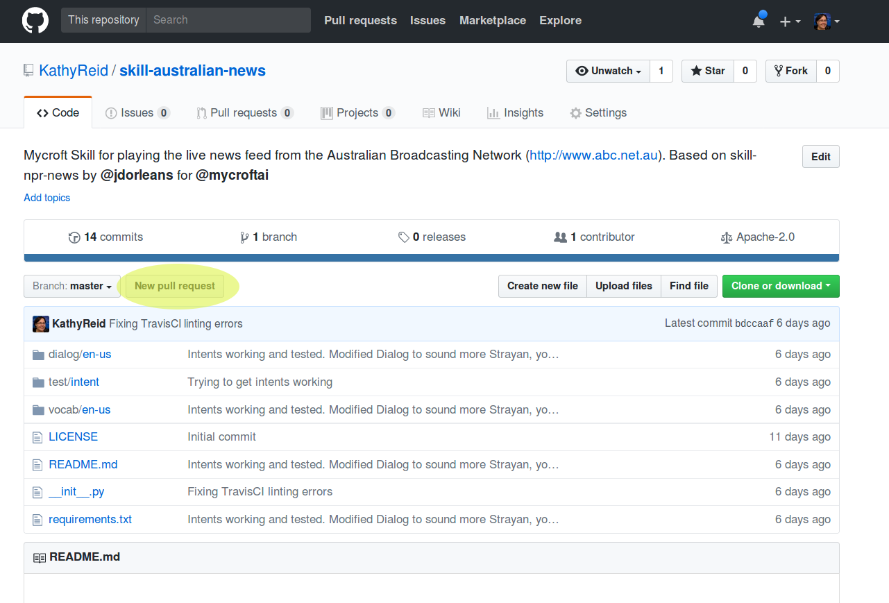

# Preparing your Skill for submission to the Mycroft Skills Repo

It's important that you prepare your **Skill** for submission to the Mycroft Skills Repo so that:

* Your **Skill** can easily be reviewed by the Skill Management Team
* Your **Skill** is added in a way that allows dependencies to be managed
* Your **Skill** is well documented for people who may wish to use it.

### Generate a README.md file for your **Skill**
First, you need to generate the README.md file for your **Skill** using the [Meta Editor](http://rawgit.com/MycroftAI/mycroft-skills/master/meta_editor.html). Fill out all the relative fields, and it will generate the Markdown to put into your README.md file. Save your README.md file.

_NOTE: This following sections of documentation assume that you have set up a `remote` for your Git repository. If you have been developing locally, please pause here, and push your local development to a remote repository on GitHub. [New to working with remotes? Here's a handy guide](https://help.github.com/articles/adding-a-remote/)._

### Add a Git submodule for your **Skill**
Next we need to add the Submodule for your **Skill**. For more help on Submodules in GitHub, feel free to check out [this guide](https://github.com/blog/2104-working-with-submodules)

Or, type the following in the terminal, assuming you are in the directory where you cloned `mycroft-skills`:

```bash
git submodule add $remote $name-your-skill
```
where ``$remote` is the git address for your repo [example] (https://github.com/mycroftai/skill-configuration) and ``$name-your-skill` is the name you have given to your **Skill**. In general, we normally use BLANK-skill as a format for **Skill** names.

This should have edited the ``.gitmodule` file and added something similar to the bottom of the file:
```
+[submodule "NAME OF YOUR SKILL"]
 +	path = name-of-your-skill-skill
 +	url = URL.FOR.YOUR.SKILL.git
```

### Modify the Mycroft Skills Repo README.md file with your **Skill**
Modify the table section in the `README.md` file of the `mycroft-skills` repo to include the file direct link to your repo like the following example. Include the `<br>` tag and the phrase to trigger your skill:

```
| :heavy_check_mark:  | [home-assistant](https://github.com/btotharye/mycroft-homeassistant#readme)| Control your devices in home-assistant<br>```turn on office
```

Ensure to include a status from the list below. This allows people to identify which **Skills** are mature, and which are under development.

**Status meaning:**
:heavy_check_mark: good working order
:construction:     still being developed and not ready for general use (for reference/collaboration)
:question:         untested (by us)
:skull:            Broken, but good for ideas!

### Submit a PR (Pull Request) in GitHub to have your **Skill** listed

Next, we need to submit a Pull Request (PR) in GitHub to have your **Skill** listed.

* Ensure that you have done a `git commit` for all your files, and that you have done a `git push -u origin master` so that your local files have been pushed to your GitHub repository.
* Next, go to the GitHub repo for your **Skill**. Click the 'New Pull Request' button as shown in the image below.



* You will need to choose with repositories to compare and create a PR from. This will  usually be `MycroftAI/mycroft-skills/master` and `YourGitHubUsername/mycroft-skills/master`
* When  you create a PR, you will be presented with a PR template to fill in. This helps to make sure that your **Skill** is ready for submission. It will look like this:

```md
## Description:
Short description of your skill and what it does
## Checklist:
  - [ ] Used [Meta Editor](http://rawgit.com/MycroftAI/mycroft-skills/master/meta_editor.html) to generate the skill README
  - [ ] Skill has been tested and works
  - [ ] README.md has been updated with the following:
  +[submodule "NAME OF YOUR SKILL"]
  +	path = name-of-your-skill-skill
  +	url = URL.FOR.YOUR.SKILL.git
 - [ ] README.md has been updated with your skill phrase and description
```

Fill in the PR template and submit your PR.

There are two continuous integration (CI) tools that Mycroft uses, and these CI tools will automatically trigger when you submit your PR:

* Codacy for test coverage
* TravisCI for Python code linting

The most common issue reported by the CI tools are [PEP8 code linting](https://pypi.python.org/pypi/pep8) failures. It's a good idea to run your Python code through a PEP8 checker before submitting your PR. 

### MSM Compliance
To make your skill capable of being installed via MSM (the Mycroft Skill Manager) you need two additional files.
* `requirements.txt`
* `requirements.sh`

requirements.txt is a list of all `pip` libraries your skill needs (if any).

requirements.sh is a shell script that executes and installs package dependencies your **Skill** needs (if any).
So, if you need a specific `pip` library installed, like `gensim`, you can have it automatically installed in the correct vm using `msm`.

This requirements.txt file would look like this:
```
gensim
```

### What happens next?

The Skills Management Team will review your PR, and check the Python code in your Skill for any obvious errors or red flags. If they're comfortable, your **Skill** will be merged into the Mycroft Skills Repo. They may make suggestions for enhancement, or request that you make alterations to your code before it is merged.

It's also a good idea to announce that you have a **Skill** PR waiting in the [Skills Channel on Mattermost](https://chat.mycroft.ai/community/channels/skills).
