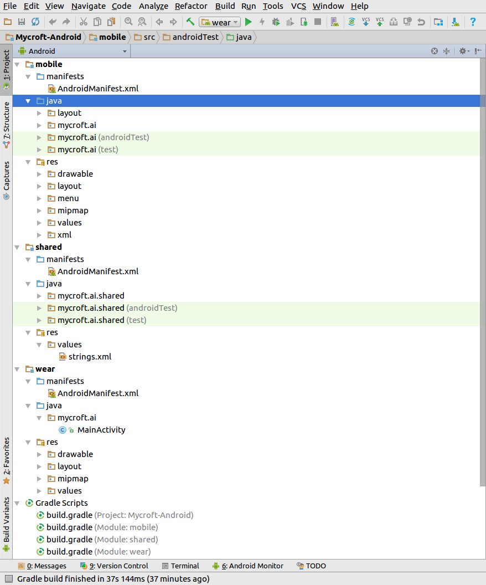

# Mycroft for Android

- [Mycroft for Android](#mycroft-for-android)
    + [Prerequisites](#prerequisites)
    + [Getting Started](#getting-started)
    + [Connecting to a `mycroft-core` instance](#connecting-to-a-mycroft-core-instance)
    + [Pairing Mycroft for Android](#pairing-mycroft-for-android)
      - [Keeping Mycroft for Android updated](#keeping-mycroft-for-android-updated)
    + [Common issues with Mycroft for Android](#common-issues-with-mycroft-for-android)

There are two components to Mycroft for Android:

1. The Android companion app. The app works by opening a websocket connection to the `mycroft-core` messagebus, and sending and receiving messages from there. It implements voice recognition and Text to Speech (TTS) via Google APIs at the moment,

2. Mycroft Core. Mycroft for Android requires that you already have `mycroft-core` installed and working on a machine that the Android application can access via a websocket connection.

### Prerequisites

This section of documentation assumes the following:

* That you already have [Android Studio](https://developer.android.com/studio/index.html) installed, and are familiar with using Android Studio. If not, [this introduction](https://developer.android.com/studio/intro/index.html) is a good starting point.
* That you already have an Android device, and that you're comfortable loading Android applications on to the device from Android Studio.

### Getting Started

First, you will need to clone the `git` repo and import it into your IDE.

```
$ git clone https://github.com/MycroftAI/Mycroft-Android
Cloning into 'Mycroft-Android'...
remote: Counting objects: 1381, done.
remote: Total 1381 (delta 0), reused 0 (delta 0), pack-reused 1381
Receiving objects: 100% (1381/1381), 538.46 KiB | 210.00 KiB/s, done.
Resolving deltas: 100% (648/648), done.
Checking connectivity... done.
```

From Android Studio, choose `File -> Open file or Project` and select the directory you cloned `Mycroft-Android` into. Android Studio will attempt to load the project, and build the project using [Gradle](https://gradle.org/). You may be prompted to install additional components.



### Connecting to a `mycroft-core` instance

@TODO not sure how this works

### Pairing Mycroft for Android

There is no need to pair Mycroft for Android, as the companion app connects to your `mycroft-core` instance, and uses the pairing from that.

#### Keeping Mycroft for Android updated

The easiest way to keep Mycroft for Android updated is to clone the `git` repo when you want to build a new image to deploy to your Android phone.

### Common issues with Mycroft for Android

@TODO link to Troubleshooting